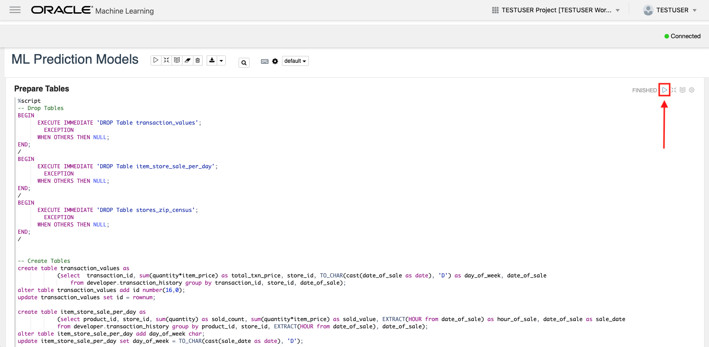

# Lab 200 - Using OML to Run a Machine Learning Model and SQL Developer to Grant User Privileges

Updated: October 10, 2019

## Introduction

This lab walks you through the steps to make an OML user and use SQL Developer as an interface to the ADW instance for granting user privileges. Then you will use OML to run a SQL script to generate machine learning models.

**_To log issues_**, click here to go to the [github oracle](https://github.com/oracle/learning-library/issues/new) repository issue submission form.

## Objectives
-   Learn how to make an OML user
-   Learn how to connect to your new Autonomous Data Warehouse using SQL developer
-   Learn how to grant user privileges using SQL developer
-   Learn how to run an OML script

## Required Artifacts
-   The following lab requires an Oracle Public Cloud account. You may use your own cloud account, a cloud account that you obtained through a trial, or a training account whose details were given to you by an Oracle instructor.

-   Oracle SQL Developer 18.3 or later (see <a href="http://www.oracle.com/technetwork/developer-tools/sql-developer/downloads/index.html" target="\_blank">Oracle Technology Network download site</a>)
Please use SQL Developer version 18.3 or later as this version contains enhancements for key Autonomous Data Warehouse features, including using ADW behind a VPN or Firewall.

# Using OML to Run a Machine Learning Model and SQL Developer to Grant User Privileges

In this section, you will create an OML user and then connect the SQL Developer to the ADW instance that you provisioned in Lab 100 and grant your OML user priveleges to make changes to the ADW database.

## Part 1. Creating an OML User

### **STEP 1**: Creating OML Users

- Click the **Service Console** button on your Autonomous Data Warehouse details page.

- Click the **Administration** tab and click **Manage Oracle ML Users** to go to the OML user management page.

This will open a new tab within your browser that may ask you for a username and password.

-   Enter **admin** as the username and use the password you specified when provisioning your ADW instance.

-   Click **Create** button to create a new OML user. Note that this will also create a new database user with the same name. This newly created user will be able to use the OML notebook application. Note that you can also enter an email address to send an email confirmation to your user (*for this lab you can use your own personal email address*) when creating the user.

-   Enter the required information for this user, name the user as **testuser**. If you supplied a valid **email address**, a welcome email should arrive within a few minutes to your Inbox. Remember your password if you choose to create it in this step. If you do not create it in this step, the user will receive an email and will be able to create a new password through there.  Click the **Create** button, in the top-right corner of the page, to create the user.

-   After you click **Create** you will see that user listed in the Users section.

-   Below is the email which each new user receives welcoming them to the OML application. It includes a direct link to the OML application for that user which they can bookmark.  If you didn't already create a password for your user in the step above, click on the **Access Oracle ML SQL notebook** button in the email, and you will be taken to the site where you can create a password for your new user account.

You will use this user later in this workshop.

## Part 2. Connect SQL Developer to the ADW Instance and Grant Privileges to OML Users 

### **STEP 1**: Download the Connection Wallet
As ADW only accepts secure connections to the database, you need to download a wallet file containing your credentials first. The wallet can be downloaded either from the instance's details page, or from the ADW service console. In this case, we will be showing you how to download the wallet file from the instance's details page.

-   Go back to the Cloud Console and open the Instances screen. Find your database, click the action menu and select **DB Connection**.

-   Under Download a Connection Wallet, click **Download**.

-   Specify a password of your choice for the wallet. You will need this password when connecting to the database via SQL Developer later, and is also used as the JKS keystore password for JDBC applications that use JKS for security. Click **Download** to download the wallet file to your client machine. Download the wallet to a location you can easily access, because we will be using it in the next step.
*Note: If you are prevented from downloading your Connection Wallet, it may be due to your browser's pop-blocker. Please disable it or create an exception for Oracle Cloud domains.*

### **STEP 2**: Connect to the database using SQL Developer
Start SQL Developer and create a connection for your database using the default administrator account 'ADMIN' by following these steps. You will grant the testuser username specific privileges.

-   Click the **New Connection** icon in the Connections toolbox on the top left of the SQL Developer homepage.

-   Fill in the connection details as below:

-   **Connection Name:** ADWRETAIL@ADMIN

-   **Username:** ADMIN

-   **Password:** The password you specified during provisioning your instance

-   **Connection Type:** Cloud Wallet

-   **Configuration File:** Enter the full path for the wallet file you downloaded before, or click the **Browse...** button to point to the location of the file.

-   **Service:** There are 3 pre-configured database services for each database. Pick **adwretail_low** for this lab. For
example, the database you created was named adwretail, select adwretail_low as the service.

*Note : SQL Developer versions prior to 18.3 ask for a **Keystore Password.** Here, you would enter the password you specified when downloading the wallet from ADW.*

-   Test your connection by clicking the **Test** button, if it succeeds save your connection information by clicking **Save**, then connect to your database by clicking the **Connect** button. An entry for the new connection appears under Connections.

-   *Note: If you are behind a VPN or Firewall and this Test fails, make sure you have <a href="https://www.oracle.com/technetwork/developer-tools/sql-developer/downloads/index.html" target="\_blank">SQL Developer 18.3</a> or higher. This version and above will allow you to select the "Use HTTP Proxy Host" option for a Cloud Wallet type connection. While creating your new ADW connection here, provide your proxy's Host and Port. If you are unsure where to find this, you may look at your computer's connection settings or contact your Network Administrator.*

### **STEP 3**: Grant Privileges to the OML User to Access Datasets
In order to avoid running into an access error when you run the code in OML, grant all privleges to the OML user for the tables you created in the database.

-   Under your connection in the SQL Developer, expand the hierarchy tree and search for **Other Users**. Expand it and find your OML user you created labeled **testuser**.

-   Right click the user and select **Edit User...**.

-   In the popped up screen, navigate to **System Privileges** and click the checkboxes under the **Admin Option** column for the following Privileges: **ALTER ANY TABLE**, **CREATE ANY TABLE**, **CREATE TABLE**, **DELETE ANY TABLE**, **DROP ANY TABLE**, **INSERT ANY TABLE**, **READ ANY TABLE**, **SELECT ANY TABLE**, **UNDER ANY TABLE**, **UPDATE ANY TABLE**.

-   Once they have all been selected, click **Apply**. 

-   After a few moments, click anywhere again and a Successful pop up window should show up. Click **OK**.

-   This will grant the necessary privileges for the OML user **testuser** to run the future prediction model OML script.

## Part 3. Use OML to Run a Machine Learning Script and Generate a Model

### **STEP 1**: Import an OML script

-   Navigate to and click on **Oracle ML SQL Notebooks** from the development page of your ADW instance service console.

-   Sign in as **testuser** with the appropriate password.

-   Click on **Notebooks** under the **Quick Actions** section.

-   Click **Import** and select **ML Prediction Models.json** from the **files** folder for this lab.

-   After the successful import message pops up, click on the notebook.

### **STEP 2**: Run the OML script
-   OML notebooks are structured with Paragraph sections that consist of markdown and SQL code. The paragraphs can be run one by one or all together.

-   In order for the notebook to communicate with the database, an interpreter binding must be set for the database connection. Click on the **Gear** interpreter binding button and click on **adwretail_low**. To run this script, a low concurrency option is preferred to avoid script errrors.

-   Click **Save** to bind the connection to the OML interpreter.

-   Now we have to run the scripts in the ML Notebook.  It is recommended that you run each of the notebooks separately.  To do so, click the **Run** button on the top right of each script, outlined in red in the image below.  You must do this for each script in the notebook.  Do not run the next script until the script before it has finished running.  These must be done sequentially.  When the script has finished running, it will say **FINISHED** next to the "run" button.  If the run was unsuccessful, it will say **ERROR** next to the "run" button.  If this happens, try running the script again.  Make sure to run every script in the notebook.  Note: some notebooks may take longer to run than others.  In particular, the "Build the Store Prediction Model" script will likely take up to 20 minutes to run.  This is an important step in building the ML model, so be sure to be patient and wait until this script finishes running to move onto the next.  Additionally, if there is no "run" button next to a script, it does not need to be run.  Once all scripts have successfully finished running, you are ready to move on!

-   *Note: you can also select the "Run all Paragraphs" button at the top of the screen, highlighted in the image below.  This can sometimes cause errors, so it is better to run each script individually as mentioned above, but let it be known that running all paragraphs at once is an alternate option.*

-   You have just ran a prediction model using OML through a SQL script.

## Part 4. Use APEX to See the New OML Generated Tables

### **STEP 1**: Access Your APEX App

-   Navigate to and click on **Oracle APEX** from the development page of your ADW instance service console.

-   Sign in as **developer** to the **developer** workspace with the appropriate browser.

### **STEP 2**: Access the New OML Generated Tables

-   Click on **SQL Workshop** and then on **Object Browser** to view the tables of your Autonomous Data Warehouse.

-   Notice the new tables that have been added through the OML script run by the OML user you made and gave privileges to.

## Great Work - All Done with Lab 200!
**You are ready to move on to the next lab. You may now close this tab.*
