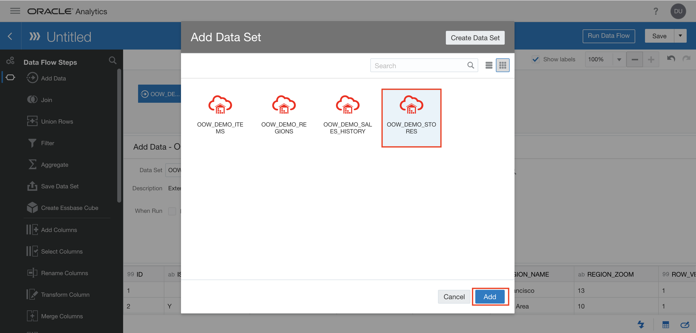
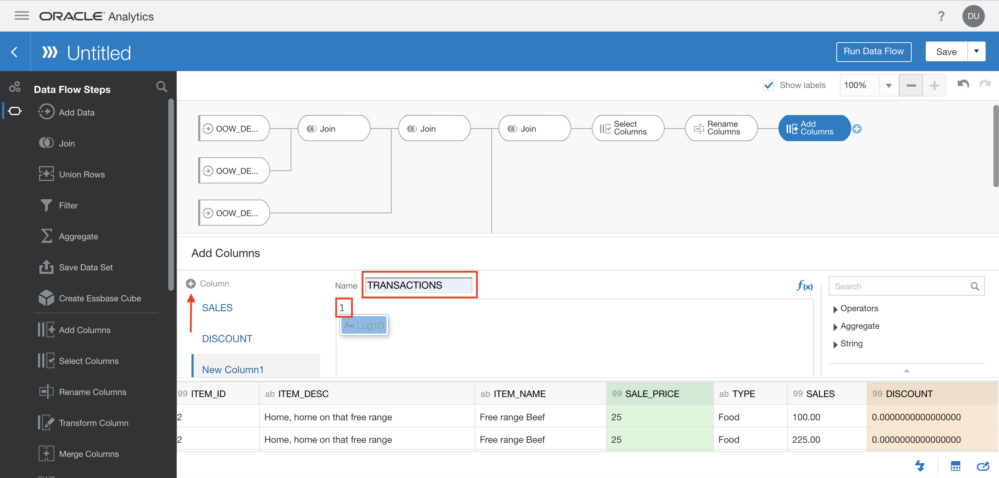
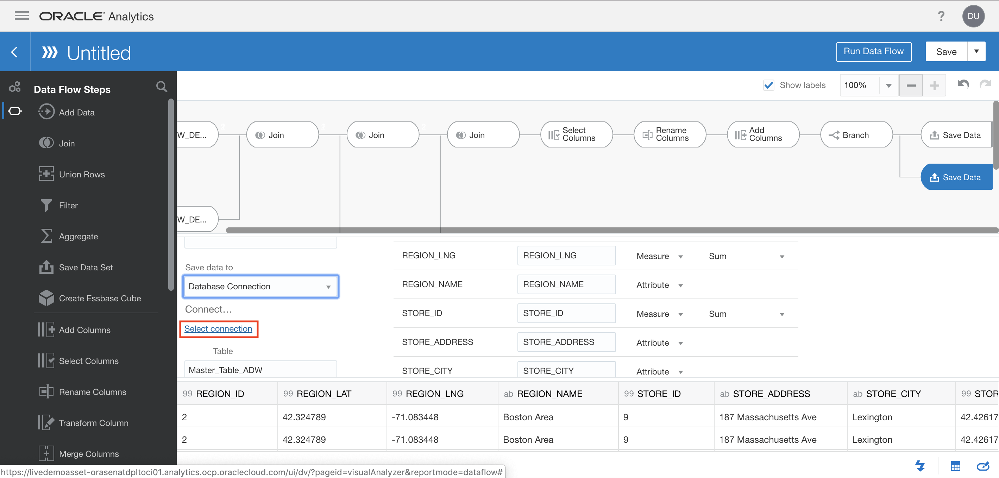

# Lab 400 - Getting Started with Oracle Analytics Cloud (OAC)

  
Updated: October 10, 2019

## Introduction

This lab walks you through the steps to provision an Oracle Analytics Cloud (OAC) instance and connect it to your Autonomous Data Warehouse (ADW) instance.

**_To log issues_**, click here to go to the [github oracle](https://github.com/oracle/learning-library/issues/new) repository issue submission form.

## Objectives
-   Learn how to provision a new Oracle Analytics Cloud Instance
-   Learn how to connect the OAC instance to your to the ADW

## Required Artifacts
-   The following lab requires an Oracle Public Cloud account. You may use your own cloud account, a cloud account that you obtained through a trial, or a training account whose details were given to you by an Oracle instructor.

# Provision Oracle Analytics Cloud (OAC) and Connect to Autonomous Data Warehouse (ADW)

## Part 1. Create an OAC Instance

### **STEP 1**: Create an OAC Instance

-   Sign in to cloud.oracle.com with your account credentials as done in the previous labs.

-   Click on the **Hamburger menu** icon. Then, scroll down to the **More Oracle Cloud Services** section, hover over **Platform Services** and then click on **Analytics**. 

-   Click on **Create Instance**.

-   Provide all the required information (fields specified by \*). For the **Instance Name**, input **OACRD**. For the **Region**, select from the dropdown box the same region as your ADW instance. For the **Number of OCPUs**, select from the dropdown box **2**.

-   Then click on **Next**.

-   After validating your configuration, click on **Create**.

-   It will take a few minutes until your instance is fully provisioned and ready to use. Note the Status and the sign which indicate that the service is being creating. Wait until this process is fully completed.

-   After a few minutes refresh your page and you will see the status and the sign are disappeared. Now your OAC instance is ready. In order to access your instance, click on the **hamburger icon** on the right side of your instance. Then, click on **Oracle Analytics Cloud URL** which redirects you to a new page. Save this web page link for future use.

-   Welcome to the Oracle Analytics Cloud! Enjoy exploring it!

## Part 2. Connect OAC to ADW

### **STEP 1**: Connect OAC to ADW

-   In the Oracle Analytics Cloud Homepage, click on the **Create** button on the top-right and then click on **Connection** in the popped menu.

-   Select the **Oracle Autonomous Data Warehouse Cloud** from the existing connection types.

-   Complete all the required fields in the wizard as described in the steps below and Save the connection. Note that you need the ADW instance **Wallet** file in order to be able to complete these fields (this step is similar to connecting  SQL Developer to the ADW instance). Please refer to previous labs for a refresher on how to access a Wallet file if needed.

-   You should fill the following connection fields, then click **Save**:

-   **Connection Name:** Type a name for this connection. For this lab, use **ADWRETAIL**.

-   **Client Credentials:** Click on **‘Select’** and select the zipped **Wallet** file (The **cwallet.sso** file will be automatically extracted from the **Wallet** file)

-   **Username:** Admin (the username you created during the ADW provisioning).

-   **Password:** The password you specified during the provisioning of your ADW instance.

-   **Service Name:** Select your database name and desired service level (low, medium, high) from the drop down list. For this lab, select your instance service named **ADWRETAIL_high**.

-   You can now see your connection listed under the Connections tab in the Data page.

## Part 3. Import Datasets from ADW to OAC

### **STEP 1**: Configure a Database Connection

-   In the Oracle Analytics Cloud Homepage, click on the **Create** button on the top-right and then click on **Data Set** in the popped menu.

-   Select the connection that you have created in previous step.

-   Select the **DEVELOPER** user from the list of users to import the datasets prepared in SQL Developer.

### **STEP 2**: Import the Datasets to OAC

Now we should import the **OOW_DEMO_STORES**, **OOW_DEMO_REGIONS**, **OOW_DEMO_ITEMS**, and **OOW_DEMO_SALES_HISTORY** tables to OAC. In the next steps, we show you how to import the **OOW_DEMO_STORES** table. You can repeat the same steps to import the other three tables.

-   Select the desired table (**OOW_DEMO_STORES** is the first one to import) from the list.

-   Add all columns to your selection by clicking on **Add All**. The auto-generated name for the new table will work fine. 

-   Finish by clicking on **Add**. 

-   When the data set is loaded, change columns containing **ID** (such as **ID**, **REGION_ID**, **STORE_ID**, **PRODUCT_ID**, etc.) from **Measure** type to **Attribute** type. In order to do so, click on the # sign next to the column name and select **Attribute** from the drop-down menu. Each data set will have a varying amount of columns containing **ID**. Make sure to check through all columns. The reason for changing the type is because we will not be performing any math operations on the IDs and hence we should treat the IDs as attributes.

-    Then click on **Apply Script**.

-   You are done with adding the first table. 

### **STEP 3**: Add Additional Datasets

-   Repeat "Part 3 STEP 1" and "Part 3 STEP 2" for the remaining 3 tables mentioned above (**OOW_DEMO_REGIONS**, **OOW_DEMO_ITEMS**, and **OOW_DEMO_SALES_HISTORY** tables ).

-   After importing all the tables, you can see them by first clicking the **Hamburger menu** icon and then click on the **Data** section which should default to the **Data Sets** tab. 

-   Confirm that you have imported 4 tables.

## Part 4. Create a Data Flow

### **STEP 1**: Add and Join the Datasets

-   First, navigate back to the Oracle Analytics Cloud home page. Once you are back on the home page, click on **Create**, then on **Data Flow** to create a new data flow. 

-   A window will pop up asking for data sets to be selected. Continue by clicking on the **OOW_DEMO_REGIONS** Data Set and then clicking on **Add**.

-   Click on the **Circled Plus** button and then on **Add Data**.

-   Add the next data set **OOW_DEMO_STORES** by clicking on it and then clicking on **Add**.

-   This will generate a Join step in the Data Flow Diagram. Modify it by selecting **All rows** in the drop down box for **Input 2** in the **Keep Rows** section.

-   Then, scroll down and under the **Match Columns** section, click on **ID** and then change it to **REGION_ID** from the drop down box for **Input 2**.

-   After configuring this Join step, click on the **Circled Plus** button again and then on **Add Data**.

-   Then add the next data set **OOW_DEMO_SALES_HISTORY** by clicking on it and then clicking on **Add**.

-   This will generate another Join step in the Data Flow Diagram. Modify it by selecting **All rows** in the drop down box for **Input 2** in the **Keep Rows** section.

-   Then, scroll down and under the **Match Columns** section, click on **ID** for **Input 1** and change it to **ID_1** and click on **ID** for **Input 2** and change it to **STORE_ID**.

-   After configuring this second Join step, click on the **Circled Plus** button again and then on **Add Data**.

-   Then add the next data set **OOW_DEMO_ITEMS** by clicking on it and then clicking on **Add**.

-   This will generate the third Join step in the Data Flow Diagram. Modify it by selecting **All rows** in the drop down box for **Input 1** in the **Keep Rows** section.

-   Then, scroll down and under the **Match Columns** section, click on **ID** for **Input 1** and change it to **PRODUCT_ID**.

-   Now the 4 Data Sets have been joined.

### **STEP 2**: Select Columns

-   Since we are done adding the Join steps, click on the **Circled Plus** button again and then on **Select Columns** to help finalize the columns we want to keep.

-   All the columns will be selected. Let's select some columns we want to remove from this list by holding the ctrl button(Windows) or the command button(MacOS) and left clicking on the columns. Select the following: **IS_DEFAULT_YN**, **REGION_COLOR**, **REGION_ZOOM**, **ROW_VERSION_NUMBER**, **N1**, **N2**, **N3**, **N4**, **REGION_ID**, **ROW_VERSION_NUMBER_1**, **ID_2**, **CREATED_ON**, **DATE_OF_SALE**, **PRODUCT_ID**, **STORE_ID**, and **ROW_VERSION_NUMBER_2**.

-   Having selected all the above columns, click **Remove selected**.

-   We are done with selecting our columns. 

### **STEP 3**: Rename Columns

-   Let's rename some columns. Click on the **Circled Plus** button again and then on **Rename Columns** to help finalize the columns we want.

-  

-   Under the **Source** column, find **ID** and change the value in the **Rename** column to **REGION_ID**.

-   Next, keep scrolling down and under the **Source** column, find **ID_1** and change the value in the **Rename** column to **STORE_ID**.

-   Then, find **ID_3** and change the value in the **Rename** column to **ITEM_ID**.

-   Finally, find **MSRP** and change the value in the **Rename** column to **SALE_PRICE**.

-   We are done renaming columns. 

### **STEP 2**: Add Columns

-   Let's finish constructing our master table by adding columns. Do this by clicking on the **Circled Plus** button again and then on **Add Columns** to help finalize the columns.

-   In the **Name** box, input **SALES**.

-   In the code calculation box, type in (without the quotes): "QUANTITY"

-   Wait a few seconds as the search query goes through and then click on the **# QUANTITY** popup.

-   Afterwards, continue typing the following (without the quotes): " * SALE_PRICE"

-   Wait a few seconds as the search query goes through and then click on the **# SALE_PRICE** popup.

-   Scroll down and click **Validate**.

-   After the calculation is validated, finish by clicking **Apply**.

-  Click on the **Gray Circled Plus** icon to add more columns. In the **Name** box, input **Discount**.

-   In the code calculation box, type in (without the quotes): "(ITEM_PRICE"

-   Wait a few seconds as the search query goes through and then click on the **A ITEM_PRICE** popup.

-   Afterwards, continue typing the following (without the quotes): "- SALE_PRICE)"

-   Wait a few seconds as the search query goes through and then click on the **# SALE_PRICE** popup.

-   Then, continue typing the following (without the quotes): "/ ITEM_PRICE"

-   Wait a few seconds as the search query goes through and then click on the **# ITEM_PRICE** popup.

-   Scroll down and click **Validate**. After the calculation is validated, finish by clicking **Apply**.

-  Click on the **Gray Circled Plus** icon to add more columns. In the **Name** box, input **TRANSACTIONS**.

-   In the code calculation box, type in (without the quotes): "1"

-   Scroll down and click **Validate**. After the calculation is validated, finish by clicking **Apply**.

-   Now, click the **Circled Plus** icon to make a **Branch**. 

-   Click the first **Save Data** in the data flow.  

-   Make the name **Master_Table**.

-   Click the second **Save Data** in the data flow.  Make the name **Master_Table_ADW**. 

-   Change the **Save data to** dropdown box option to **Database Connection**. 

-   Click **Select connection**.

-   Select the connection.

-   Save the entire Data Flow by clicking the top right **Save** button.

-   Name it **Retail Demo Data Flow**.

-   After it's saved, click **Run Data Flow**.

-   You are done creating the data flows for OAC. Time for visualizations!

## Great Work - All Done with Lab 400!
**You are ready to move on to the next lab. You may now close this tab.**
